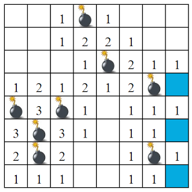

# ♡ B U S C A M I N A S ♡

El juego de buscaminas funciona de la siguiente forma:

Se muestra una tabla donde se encuentran celdas vacías, con número o con minas. En caso de oprimir una mina entonces el juego termina, si se oprimen lugares sin minas (vacía o de número), el juego continúa.

# PREGUNTAS GUÍA
* ¿Cómo puedes estructurar el tablero en el navegador? (pista: HTML)
* ¿Cómo puedes diferenciar una bomba de un número o de una celda vacía en el HTML?
* ¿Qué evento necesitas para captar el click del usuario?
* Una vez que el usuario haga click sobre la "celda", ¿qué tiene que pasar?
* ¿Cómo podemos hacer que elementos aparezcan y desaparezcan en el HTML?
* ¿Cómo hacemos para que ya no se puedan ingresar clicks del usuario? (pista: removeEventListener)
# REQUERIMIENTOS
* Mostrar una tabla de 4 x 4 (con bombas, celdas vacías y números en posición fija)
* Al dar clic en una celda vacía, cambiar de color de la celda.
* Al dar clic en una celda con bomba, terminar el juego (no debo poder clickear más celdas) y mostrar mensaje: “Esto ha explotado”
* Al dar clic en una celda con un número, mostrar el número que tiene.
* Crear un botón Reiniciar que comience de nuevo el juego.
# PUNTOS EXTRA
* Al dar clic fuera de la tabla mostrar mensaje: “Sigue jugando”. (inner html o alert).
* Preguntar el tamaño de la tabla al usar.
* Preguntar el nivel de dificultad deseada (fácil o difícil y significa el número de bombas que tendrá)
* Llenar de manera automática todo (bombas, celdas vacías y números)
